# Portabilidade

## Introdução

Esta página destina-se à apresentação produzida pelo grupo sobre Portabilidade, uma das características de qualidade SQUARe. A apresentação conceitua o Portabilidade segundo a SQUARe, bem como suas subcategorias (Adaptabilidade, Instabilidade, Substituibilidade), além de apresentar, com foco na característica de portabilidade, um artigo com o objetivo de avaliar a documentação de um software educativo a partir das normas de qualidade ISO/IEC 9126-1 para verificar as necessidades implícitas. A seguir, as figuras da apresentação.

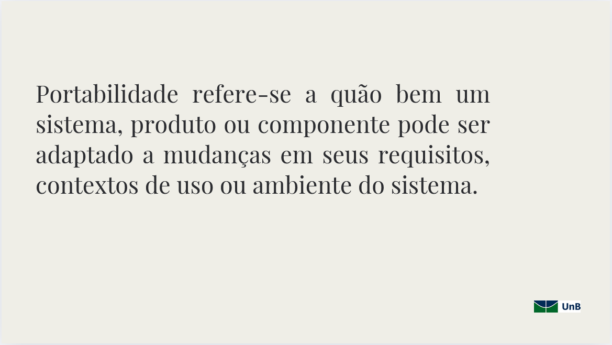

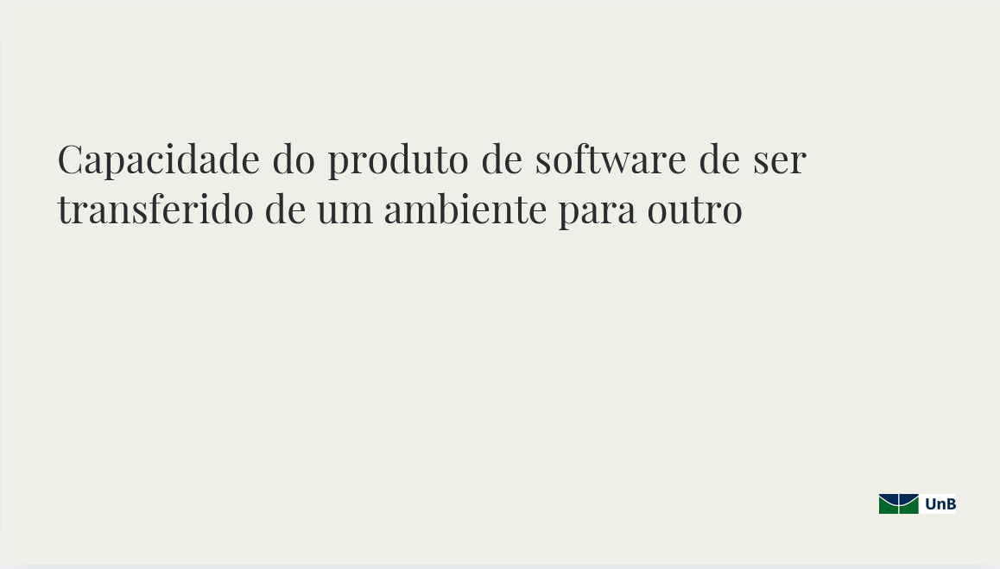

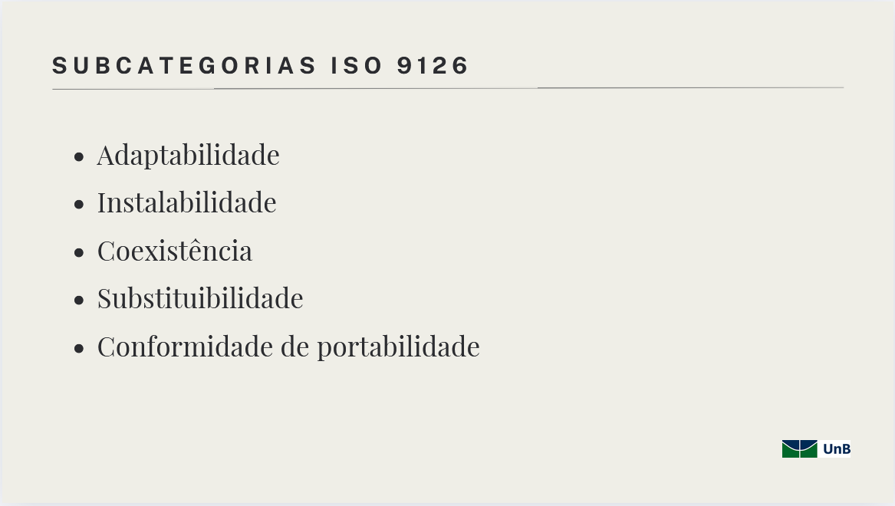

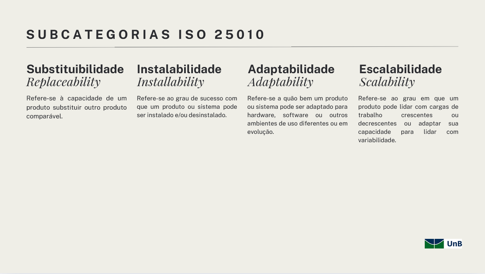

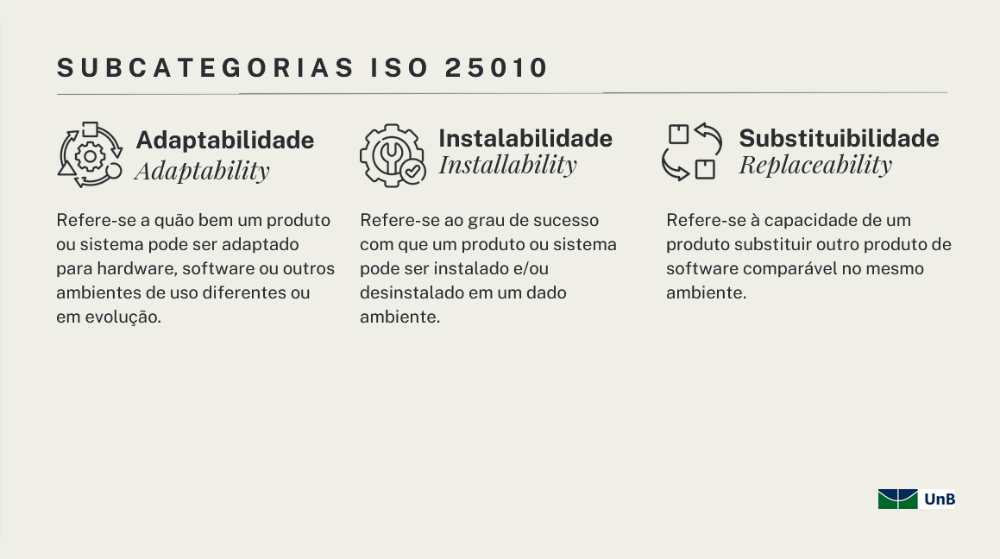

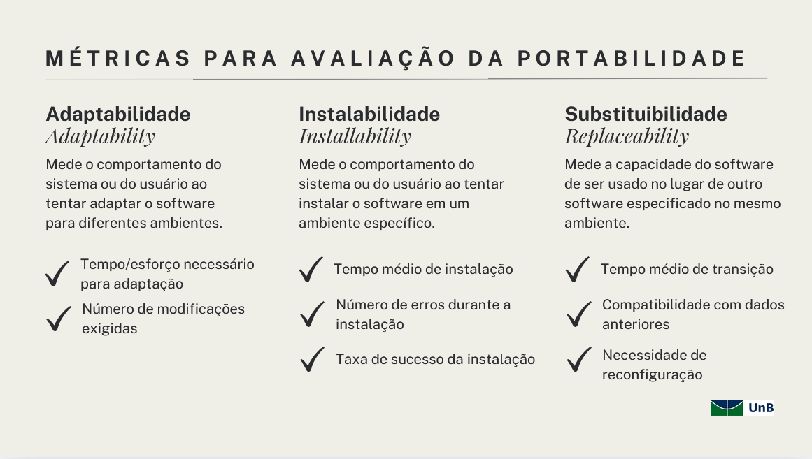

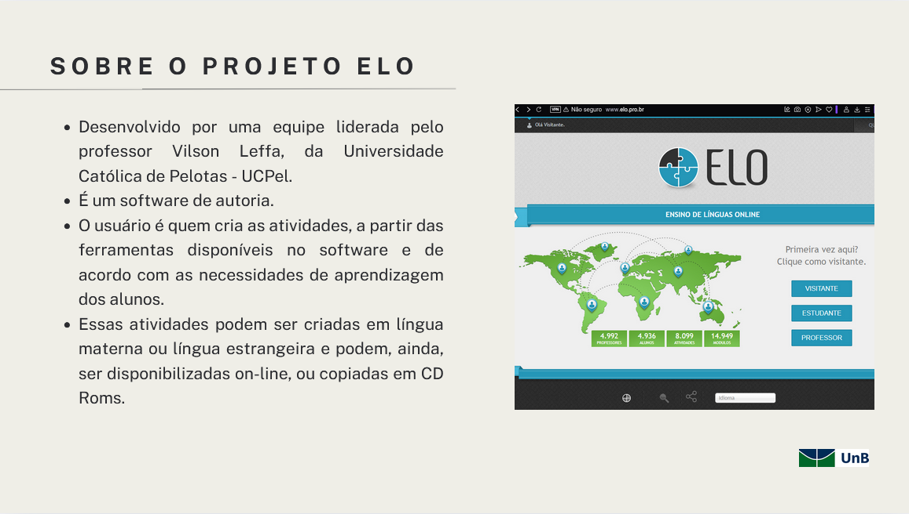

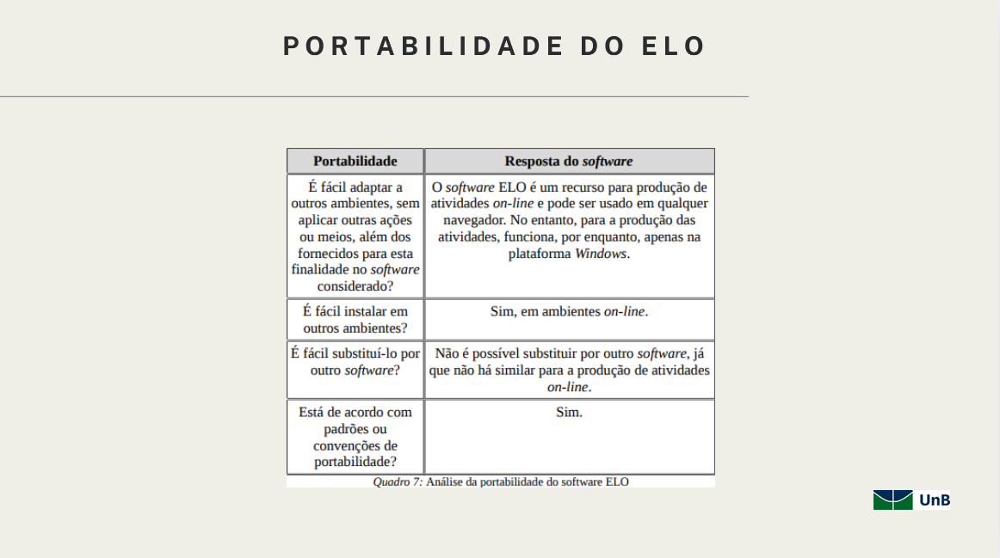

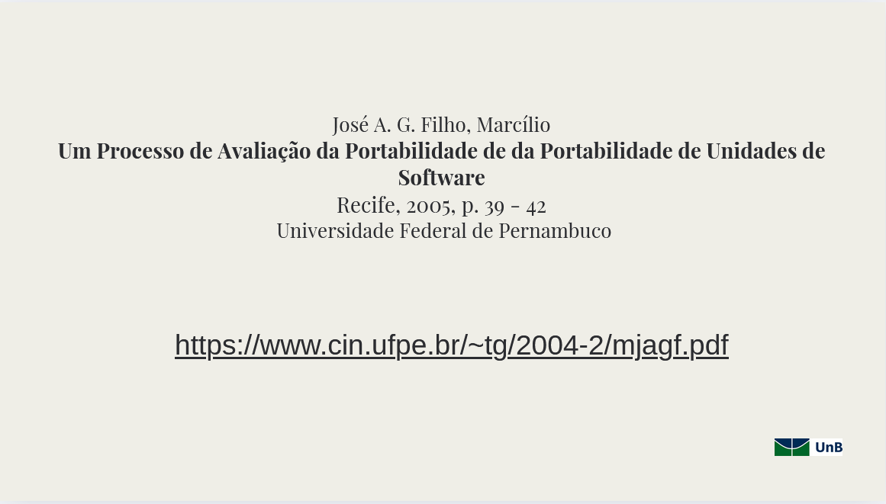

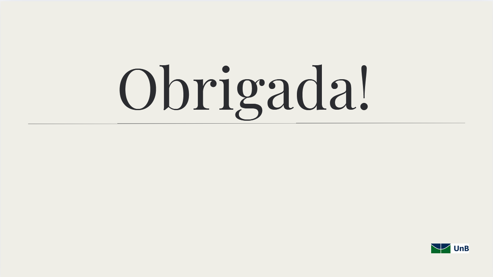

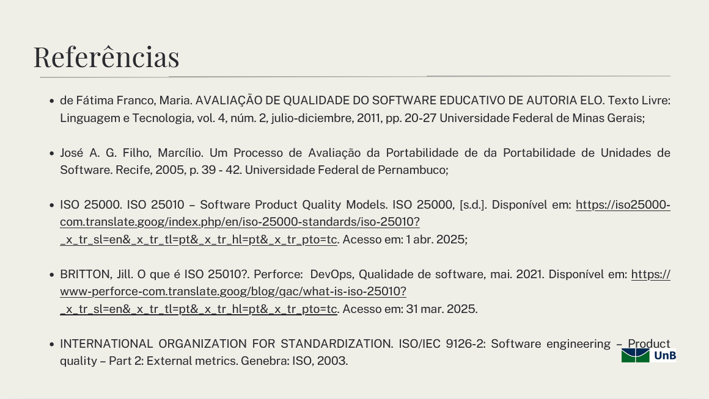

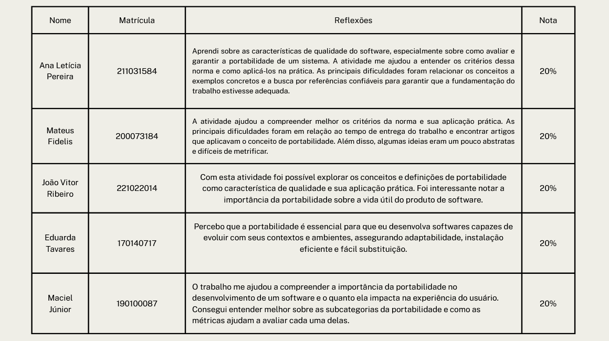

## Histórico de Versões

|Versão|Data|Descrição|Autor|Revisor|
|:----:|----|---------|-----|:-------:|
|`1.0`|03/06/2025|Criação do documento| [João Ribeiro](https://github.com/Joa0V) | [Ricardo Augusto](https:github.com/avmricardo) |