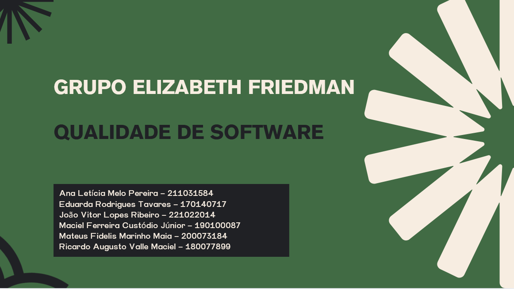
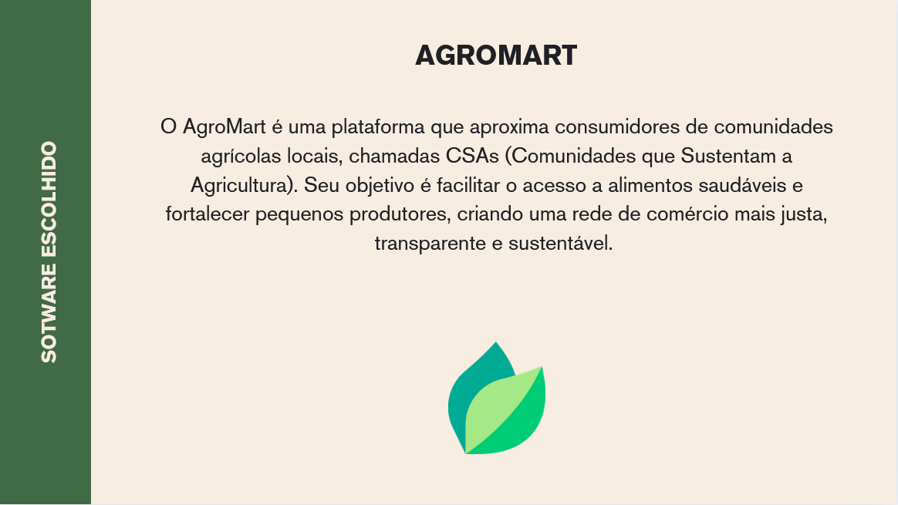
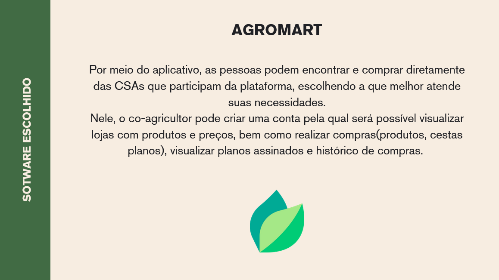
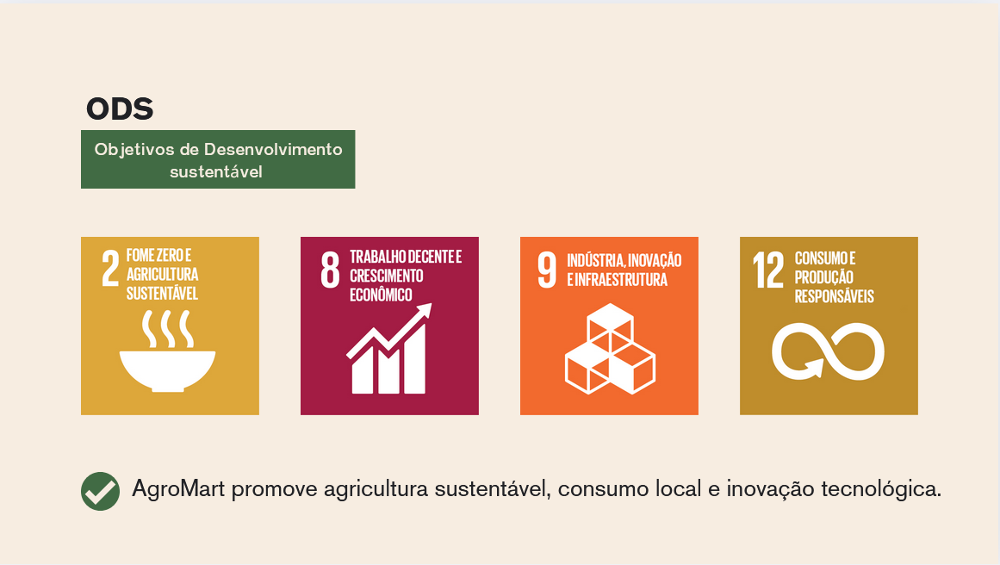
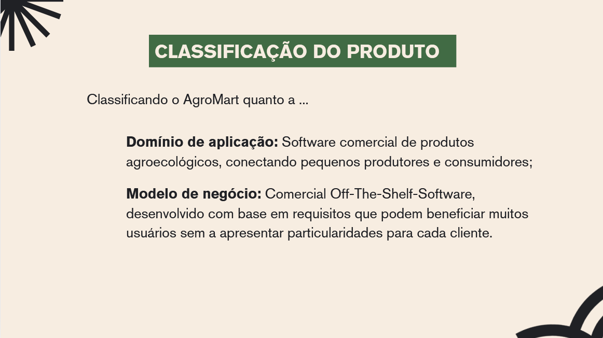
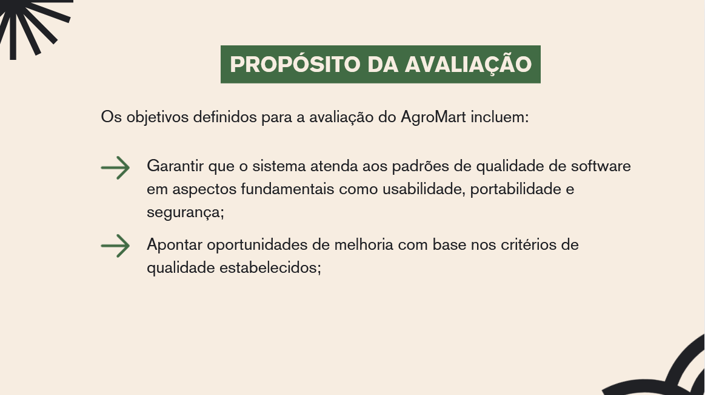
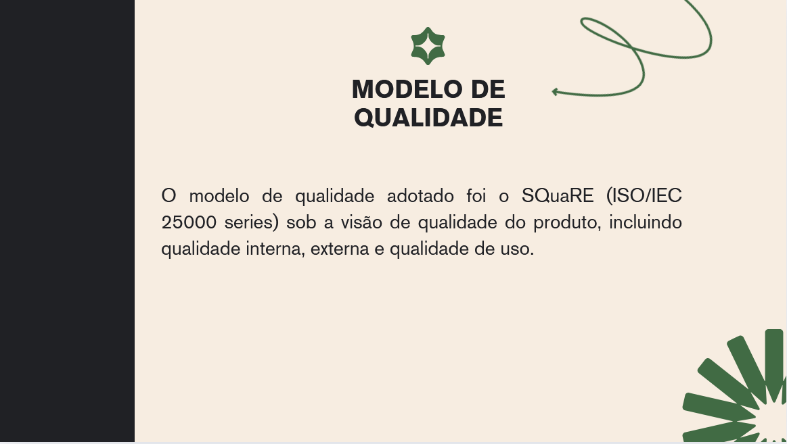
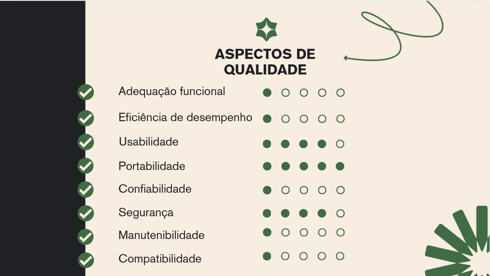
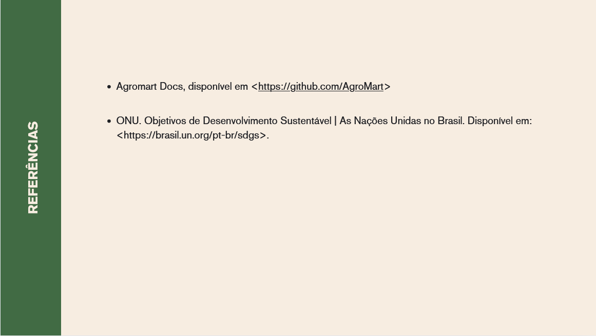

# Processo de avaliação de Produto - Fase 1

## Introdução

Esta página destina-se à apresentação produzida pelo grupo sobre a fase 1 do processo de avaliação de produto, destinada a estabelecer requisitos de avaliação. A apresentação introduz o software escolhido, classifica-o quanto ao domínio da aplicação e ao modelo de negócio, além de vincula-lo a objetivos de desenvolvimento sustentável da ONU. Ademais, foram definidos os objetivos da avaliação, o modelo de qualidade a ser adotado e os aspectos de qualidade que serão priorizados. A seguir, as figuras da apresentação.

## Histórico de Versões

|Versão|Data|Descrição|Autor|Revisor|
|:----:|----|---------|-----|:-------:|
|`1.0`|03/06/2025|Criação do documento| [João Ribeiro](https://github.com/Joa0V) | [Ricardo Augusto](https:github.com/avmricardo) |