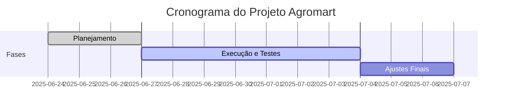

# Calendário e Progresso

## Cronograma Geral

| Semana       | Atividades Realizadas                                                      | Status         |
| ------------ | -------------------------------------------------------------------------- | -------------- |
| Semana 1     | Definição de objetivos, escopo, critérios de sucesso e planejamento geral  | Concluída      |
| Semana 2     | Execução de testes, análise de métricas, ajustes finais e documentação     | Em andamento   |

## Marcos Importantes

- Início do projeto: 24/06/2025
- Primeira entrega: 01/07/2025
- Entrega final: 07/07/2025

## Progresso Visual

## Observações

O projeto foi realizado em ritmo intensivo nas últimas duas semanas, com foco em entregas rápidas e ajustes contínuos. Pequenas pendências na automação do CI/CD serão resolvidas até a entrega final. 

---

## Histórico de Versões

| Versão | Data       | Descrição            | Autor                                            | Revisor |
| :----: | ---------- | -------------------- | ------------------------------------------------ | :-----: |
| `1.0`  | 06/07/2025 | Criação do documento | [Eduarda Tavares](https://github.com/erteduarda) |         |