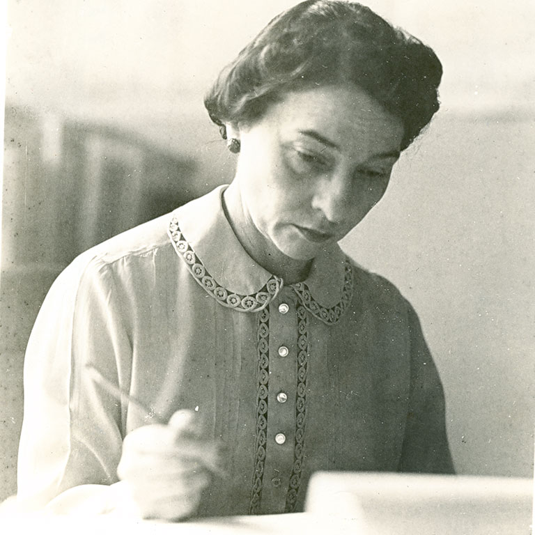

# Grupo Elizabeth Friedman - Turma 2 (2025.1)

## Sobre o Projeto

Esta página é dedicada à documentação de todos os artefatos criados pelo Grupo Elizabeth Friedman no primeiro semestre de 2025, na disciplina de Qualidade de Software da Faculdade de Gama da Universidade de Brasília (FGA-UnB).

Na figura 1 é possível encontrar a foto da mulher a qual nomeia o nosso grupo, Elizabeth Friedman.

Elizabeth Friedman foi uma criptanalista pioneira que desempenhou um papel crucial durante a Segunda Guerra Mundial, decifrando códigos inimigos e contribuindo significativamente para a segurança nacional. Seu trabalho não só ajudou a encurtar a guerra, mas também lançou as bases para a criptografia moderna. Seu legado inspira gerações de profissionais da área de tecnologia, especialmente mulheres que seguem seus passos em um campo historicamente marcado por desigualdade de gênero.

  
<b>Figura 1: Elizabeth Smith Friedman</b>

  <b>Fonte: <a href="https://research.impact.iu.edu/key-areas/cyber-and-national-security/stories/elizebeth-friedman-event.html">Indiana University</a>, Elizebeth Smith Friedman working at a desk. Photo provided by the George C. Marshall Foundation</b>

## Equipe

<table>
  <tr>
    <td align="center"><a href="https://github.com/analeticiaa"> <b>Ana Letícia</b></a> 
    <td align="center"><a href="https://github.com/erteduarda"> <b>Eduarda Tavares</b></a> </td>
    <td align="center"><a href="https://github.com/Joa0V"> <b>João Vitor Lopes Ribeiro</b></a> 
    <td align="center"><a href="https://github.com/macieljuniormax"> <b>Maciel Ferreira Custódio Júnior</b></a> </td>
    <td align="center"><a href="https://github.com/MatsFidelis"> <b>Mateus Fidelis Marinho Maia</b></a> 
    <td align="center"><a href="https://github.com/avmricardo"> <b>Ricardo Augusto Valle Maciel</b></a> 
  </tr>
</table>

## Histórico de Versões

|Versão|Data|Descrição|Autor|Revisor|
|:----:|----|---------|-----|:-------:|
|`1.0`|22/05/2025|Criação da página inicial|[Eduarda Tavares](https://github.com/erteduarda)|[Maciel Ferreira](https://github.com/macieljuniormax)|
